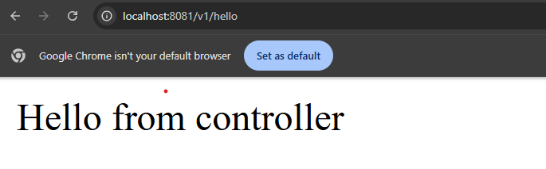
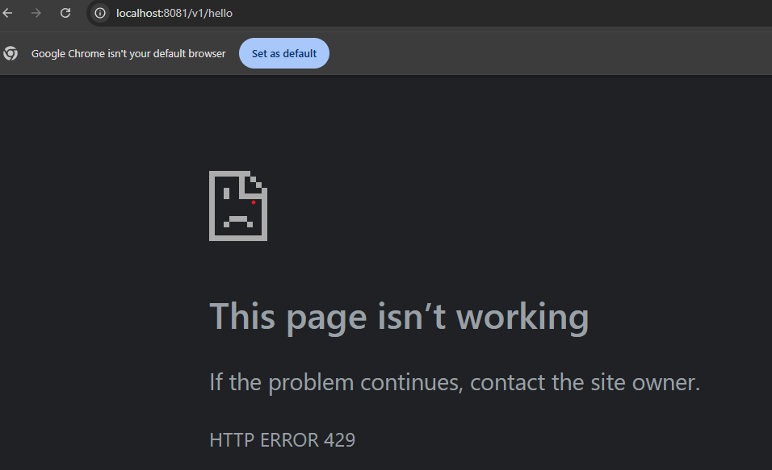

# Rate Limiting 

Rate limiting is a technique used in computing to control the amount of incoming or outgoing traffic to or from a network. application or an API.
This practice is vital for ensuring the stability security, and performance of systems that handles large volumes of requests, particularly in environments where multiple users interact with the system concurrently.

Here I have tried to put a way to create a rate limiter in spring boot using ***Bucket-4j***.

## Using plain java :

Before that to understand the concept of rate limiter using plain java, there is an implementation at
>java/com/example/rate_limiter/standalone/RateLimiter.java

For creating a rate limiter we have to take following things into consideration.

1. A data structure to hold the record of users and their corresponding requests (here we used hashmap).
2. Updating the record data structure with new timestamp every time a new request come.
3. Clearing out the timestamp records which exceeds the timeout.
4. Check if the record count is less than the limiter count.

````
-> This hashmap is for storing the timestamp records for particular user
HashMap<String, List<Long>> requestRecord = new HashMap<>();

-> Logic to implement the Rate limitier.
 if (requestRecord.containsKey(userId)){

            List<Long> newTimestampList = new ArrayList<>(requestRecord.get(userId));

            newTimestampList.add(System.currentTimeMillis());

            newTimestampList = newTimestampList.stream()
                    .filter(timestamp -> System.currentTimeMillis() - timestamp < LIMIT_TIMEOUT)
                    .collect(Collectors.toList());
            requestRecord.put(userId, newTimestampList);

            return newTimestampList.size() <= LIMIT_COUNT;
        } else {
            requestRecord.put(userId, List.of(System.currentTimeMillis()));
            return true;
        }
````

## Using Bucket-4j :

For detail explanation refer official documentation - 
>https://bucket4j.com/8.14.0/toc.html
> 

### Concepts in token bucket :
 - Capacity : Number of tokens in the bucket.
 - Refill : Refill specifies how fast tokens can be refilled after it was consumed from a bucket.

> https://en.wikipedia.org/wiki/Token_bucket
 
 
### Required dependencies :
```
implementation 'com.bucket4j:bucket4j-core:8.7.0'
```

### Create Bucket configuration : 

Refer :
> java/com/example/rate_limiter/config/RateLimiterConfig.java

Define capacity (number of tokens), refill strategy (Greedy or in Intervals) and the duration 
at which the token will be refilled.

Greedy -> This type of refill greedily regenerates tokens manner, it tries to add the tokens to the bucket as soon as possible. For example refill "10 tokens per 1 second" adds 1 token per every 100 milliseconds, in other words, the refill will not wait 1 second to regenerate a bunch of 10 tokens

Intervally -> refills entire specified tokens after a specified duration. 

IntervallyAligned -> Similar to intervally, this refills all token after an interval. Additionally, we 
can specify, when the first refill should happen.

```
    public Bucket bucket(){
        Bandwidth limitInterval = Bandwidth.builder().capacity(3).refillIntervally(1, Duration.ofSeconds(10)).build();
        return Bucket.builder().addLimit(limitInterval).build();
    }
```

### Create Filter configuration for the Bucket : 

Get the Http session, and using that session we can use any http attribute as a key (as per requirement) to get the 
tokens for that corresponding key and generate a bucket object out of it.

And from that bucket we are going to consume 1 token every time a new request is coming.
When all tokens are used, return HttpStatus.TOO_MANY_REQUESTS

```
    HttpServletRequest httpRequest = (HttpServletRequest) servletRequest;
    HttpSession session = httpRequest.getSession(true);
    
    String Key = "some-key";
    
    Bucket bucket = (Bucket) session.getAttribute("throttler-" + appKey);
    
    if (bucket == null) {
        bucket = rateLimiterConfig.bucket();
        session.setAttribute("throttler-" + appKey, bucket);
    }
    
    if (rateLimiterConfig.bucket().tryConsume(1)){
        filterChain.doFilter(servletRequest, servletResponse); // Pass the request, when not rate limited
    } else
        ((HttpServletResponse) servletResponse).setStatus(HttpStatus.TOO_MANY_REQUESTS.value());
```

### Testing :

Run the Gradle app 
> ./gradlew bootRun

Check the url in browser -

1st try :


After 3 tries :


